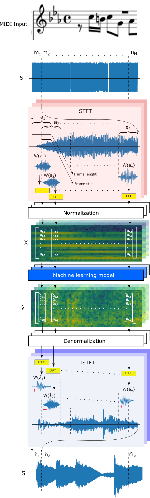
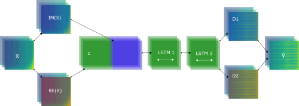
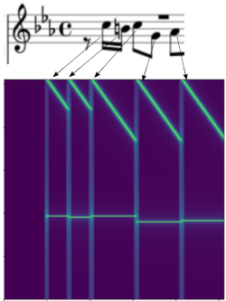
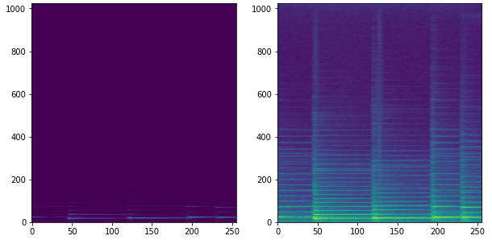
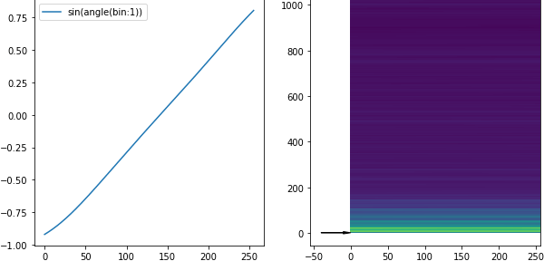
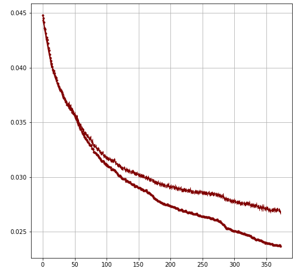
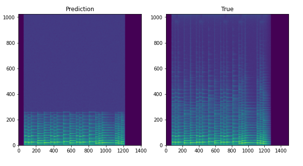
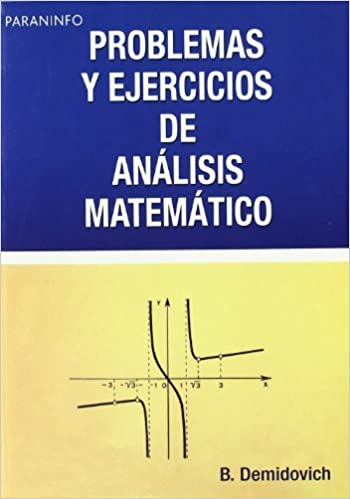

# Neural Network applied to Spectral Synthesis

I think that It's possible to use neural networks applied to spectral synthesis, in order to process and generate sound in high fidelity.

## The plan

Lets suppose we have a [MIDI](https://en.wikipedia.org/wiki/MIDI) file that have precise information about every note. Then, this is codified in a sound that sum sinusoidal waves according to velocity, pitch, duration, etc.

This codification is transformed in spectrogram using the [STFT](https://en.wikipedia.org/wiki/Short-time_Fourier_transform), and after that, the amplitude is normalized. This is complex valued.

Then, this goes to the neural network, which have to predict a new spectrogram with the same shape and type of the input.

Then, the output is denormalized and transformed in a sound using the [ISTFT](https://en.wikipedia.org/wiki/Short-time_Fourier_transform#Inverse_STFT).



## The dataset

I used Reaper and Garritan Personal Orchestra 4, to write a nayve scale sequence MIDI to render a piano as a WAV file [piano](http://ances.ai/nnss/piano_mono.wav) (@44100Hz 16 bits mono). All notes are 100 of velocity, and the duration in variable along the sequence.

I also used [Keras](https://keras.io/) and [Tensorflow](https://www.tensorflow.org/) as framework to train the neural network.

I made a lost of tryes with a PC and a RTX 2080Ti, looking for the way that this method could sound as good as possible, and I have found some stuff:

## Discoveries

* The model that gives the best results is a Double [LSTM](https://en.wikipedia.org/wiki/Long_short-term_memory) bidirectional. I tested with 3 and 4 more LSTM layers and didn´t improve the results. 



Here is a code example of the model:

```python
x= Input(shape=(None,1024), dtype=tf.complex64)
re = real(x)
im = imag(x)
c = Concatenate(axis=-1)([re,im])
lstm1 = Bidirectional(LSTM(1000, return_sequences=True, name="LSTM1"))(c)
lstm2 = Bidirectional(LSTM(1000, return_sequences=True, name="LSTM2"))(lstm1)
d1 = Dense(1024, activation="linear", name="real")(lstm2)
d2 = Dense(1024, activation="linear", name="imag")(lstm2)
y_hat = complex(d1, d2)
model = Model(inputs=x, outputs=y_hat)
```

* I tryed with a lot of architectures: CNN models are very expensive and slow to train. Every try with transforemer models gave me bad results. Only GRU works almost as good as LSTM.
* The hiperparameters of STFT matters: The shorter the [frame_step](https://www.tensorflow.org/api_docs/python/tf/signal/stft) the better the results, except that high frequencies are lost when frame_step=1. In the other hand, the longer the [frame_length](https://www.tensorflow.org/api_docs/python/tf/signal/stft) the better the results, except that the model takes more time to train, and transients start to be lost when frame_length>2048
* The best frame_length I found is 2048 (this gives 1024 frequency bins), and the best frame_step is 1 (even with the high frequencies lost).
* The MIDI codification I use is very simple: I add two sin signals: One have a frequency that depends on the note, and the second varies according to the duration of such note. I haven´t taken into account the velocity yet:



* The [window function](https://en.wikipedia.org/wiki/Window_function) that gives the best results is [Hann](https://en.wikipedia.org/wiki/Window_function#Hann_and_Hamming_windows) and [Kaiser](https://en.wikipedia.org/wiki/Window_function#Kaiser_window).
* The best loss function is [mean squared error](https://en.wikipedia.org/wiki/Mean_squared_error). I tryed with a lot of things, included Multi-Scale Spectral Loss ([DDSP](https://openreview.net/forum?id=B1x1ma4tDr)), but the results were bad.
* Sound harmonics decreases amplitude in a cuadratic way, so I use this normalizatinn function:

```python
def ances_normalization(s,power):
    ab = np.power(np.abs(s),power)
    an = np.angle(s)
    return ab*np.exp(1j*an) 
```

* I made a lot of tests with different powers. 1/2, 1/4 and 1/8 gives excelent results. If we use very little powers (1/32 or lower), the spectrogram become very sensitive to little changes of amplitude, and this precision is hard to learn for the model.



> Comparison between spectrograms without normalization (left) and normalized with power of 1/8 (right)

* I tryed with logarithmic normalization, but the results were terrible (it produces a lot of noise).
* I [figured out](notebooks/phase_analisys.ipynb) that the phase of bins are very coherent in lower frequencies, but after 200 bins, the phase starts to show aliasing:



* In order to avoid this, I tryed to oversampling the signal before the STFT, in order to reduce the aliasing. I have tested multiplying by 4 both the [Nyquist frequency](https://en.wikipedia.org/wiki/Nyquist_frequency) and the frame_length, limiting the frequency bins from 4096 to 1024 (because the rest of bins belongs to ultrasonic frequencies). This gave me a improvement in the bandwidth up to 6kHz.
* All loss curves (train and test) look like the image below:



* The model learn low bin frequencies very well (and fast), but it takes a lot of time to learn every new bin above. In the longer training period I made, I let the model training for a week, and the improvement was only 5 bins more.

* I haven't reached overfitting yet (both train and test loss curves descend "ad infinitum". 

* The best sound I have achieved is [this](http://ances.ai/nnss/test_sounds/best2.wav )

* The goal is to sound like [this](http://ances.ai/nnss/notebooks/data/bach_test_short.wav )

* And this is a comparison between both general spectrograms (normalized with power=1/8):



## Current status

I´m testing with 8x Nyquist frequency, and trying to keep the courage to let the model train for a long time.

Mean while, I'm going back to study calculus (after 15 years of living without the need to solve an integral), in order to have a deep understanding about what is happening in the Fourier Transform.



You can check the mi progress in this [notebook](notebooks/train.ipynb).

## Future work

* I want to make this method abble to generate sounds in the whole bandwidth (from 20 to 20.000 Hz). I think this is very promising, and a good way to avoid the use of nayve Griffin-Lim algorithm to phase reconstruction.

* I have the hope that this method can be used to solve the "Rompler transient problem".

* I think that it's worth studying the complex valued neural networks. I want to write the complex equivalent to RNR-GRU-LSTM equations, and implement it in tensorflow. [This](https://github.com/NEGU93/cvnn) is a good library to start to test.


## Aknowledgements, inspiration and references

This work is inspired by [Pix2Pix Timbre Transfer](https://github.com/hmartelb/Pix2Pix-Timbre-Transfer)

I like this story: [The Father of the Digital Synthesizer](https://priceonomics.com/the-father-of-the-digital-synthesizer/)
